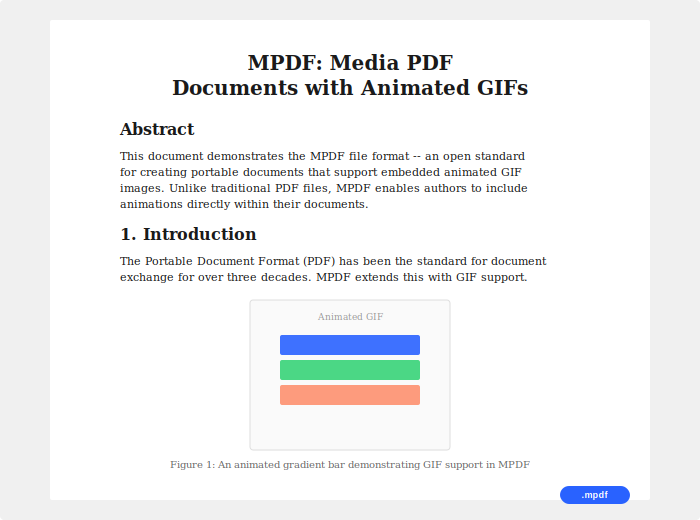

# MPDF — Media PDF

**An open document format like PDF, but with animated GIF support.**

Send someone an `.mpdf` file, they open it in their browser — boom, a paper with animated GIFs. No viewer to install, no tools, nothing.

<br>

<div align="center">

### [Live Editor](https://ruslanadilgereev.github.io/mpdf/editor/) · [Live Demo](https://ruslanadilgereev.github.io/mpdf/)

<br>

<table>
<tr>
<td>



</td>
</tr>
<tr>
<td align="center"><sub>A .mpdf document rendered in the browser — paper layout with an embedded animated GIF</sub></td>
</tr>
</table>

<br>


<sub>The animated GIF above is embedded directly inside the .mpdf file</sub>

</div>

<br>

## How it works

```
1. Create an .mpdf document       →  python mpdf-create.py ...
2. Send the file to anyone        →  email, chat, whatever
3. They open it in their browser  →  double-click or drag into browser
4. Done                           →  paper layout with animated GIFs
```

## Quick Start

**Install:**

```bash
pip install mpdf
```

**Create a document:**

```bash
mpdf create --title "My Paper" --author "Your Name" -o paper.mpdf \
    h1 "My Research Paper" \
    text "Introduction paragraph..." \
    gif figure1.gif "Figure 1: Results" \
    text "As shown in Figure 1..."
```

**Validate:**

```bash
mpdf validate paper.mpdf
```

**Open in browser:**

```bash
mpdf view paper.mpdf
```

**File type setup (one-time):**

| Platform | Command |
|----------|---------|
| Windows | Run `setup/install-windows.bat` |
| macOS | Run `setup/install-macos.sh` |
| Linux | Run `setup/install-linux.sh` |

After setup, double-click any `.mpdf` file to open it.

## What a .mpdf file looks like

```html
<!DOCTYPE mpdf>
<html data-mpdf-version="1.0">
<head>
  <meta charset="utf-8">
  <meta name="mpdf:title" content="My Paper">
  <meta name="mpdf:author" content="Author">
  <style>/* standard mpdf stylesheet */</style>
</head>
<body>
  <article class="mpdf-document">
    <section class="mpdf-page" data-page="1">
      <h1 class="mpdf-heading">Title</h1>
      <p class="mpdf-text">Your text here...</p>
      <figure class="mpdf-gif">
        
        <figcaption>Figure 1</figcaption>
      </figure>
    </section>
  </article>
</body>
</html>
```

## Format

MPDF is a self-rendering, self-contained document format. Every `.mpdf` file includes its own stylesheet and all media (GIFs) embedded as base64 — one file, no dependencies.

What makes it a standard (not just HTML):

| Feature | Description |
|---------|-------------|
| `<!DOCTYPE mpdf>` | Own doctype — identifies the format |
| `data-mpdf-version` | Versioned format (currently 1.0) |
| `mpdf:` meta tags | Standardized metadata (title, author, date) |
| `mpdf-*` CSS classes | Defined document structure |
| Standard stylesheet | Deterministic rendering everywhere |
| No `<script>` allowed | Static document format — safe to open |

See the full [Format Specification](mpdf-spec.md).

## Python Library

```python
from mpdf import MPDFDocument

doc = MPDFDocument("My Paper", author="Author Name")
page = doc.add_page()
page.add_heading("Title", level=1)
page.add_text("Hello world.")
page.add_gif("animation.gif", caption="Figure 1")
doc.save("output.mpdf")
```

## Web Editor

Full-featured MPDF editor right in your browser — no install needed:

**[Open Editor](https://ruslanadilgereev.github.io/mpdf/editor/)**

- Create documents visually (headings, paragraphs, GIFs)
- Import PDF files — each page becomes an MPDF page
- Drag & drop GIFs directly onto the document
- Export as .mpdf with one click
- Keyboard shortcuts (Ctrl+S to export, Ctrl+O to open)

## Project Structure

```
mpdf-spec.md          Format specification v1.0
mpdf-create.py        Standalone creation tool
mpdf-validate.py      Standalone validator
src/mpdf/             Python library (pip install mpdf)
docs/editor/          Web-based MPDF editor
examples/             Example documents (minimal, academic, tutorial)
setup/                Platform installers (Windows, macOS, Linux)
test.mpdf             Sample document — open in your browser
```

## Contributing

See [CONTRIBUTING.md](CONTRIBUTING.md) for how to get involved.

## License

MIT
